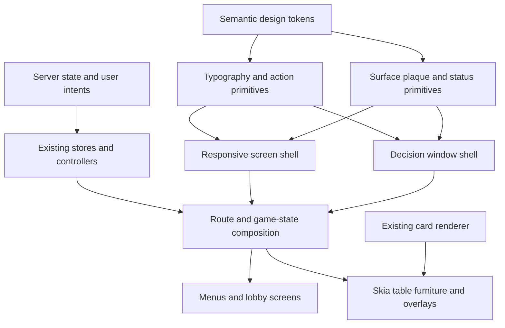

# Pidro Mobile UI Grammar and Responsive Screen System

## Goal Capsule

- **Objective:** Give every user-facing mobile screen one balanced, clean, modern-but-familiar visual grammar for menus, cards, windows, and buttons, with first-class portrait one-hand play and compact landscape play.
- **Authority:** This plan and the user's stated product direction govern presentation; the Phoenix server and existing shared contracts remain authoritative for game behavior; `packages/mobile/PRODUCT.md`, `packages/mobile/DESIGN.md`, and `packages/mobile/src/design/README.md` govern established product and visual intent.
- **Execution profile:** Refactor the mobile presentation layer in dependency order, preserve server-driven state and card-play semantics, and verify each screen family at 390 by 844 portrait and 844 by 390 landscape.
- **Stop conditions:** Stop rather than guess if the work requires changing game rules, shared API contracts, server events, card legality, or the repository's current untracked mobile-package landing boundary.
- **Tail ownership:** The executor owns implementation, cleanup, code review, portrait/landscape evidence, commits, and the PR/CI tail. The repository's conventions and the user's instructions override any landing strategy in this plan.

---

## Product Contract

### Summary

Pidro's Skia mobile app should feel immediately recognizable to players of the landscape-only legacy app while feeling calmer, clearer, and more intentional. The refactor establishes one reusable language for screens and in-game decision windows, makes portrait genuinely comfortable with one hand, reduces low-value navigation chrome, and replaces the current all-caps/heavy-weight typography with a readable hierarchy. The textured cards, warm table atmosphere, gold/cyan identity, and direct game flow remain familiar anchors.

### Problem Frame

The current mobile implementation was assembled from several visual systems. Auth screens, lobby cards, the create-room sheet, Skia table furniture, bid controls, selection modals, score history, and game-over presentation use different radii, colors, typography, spacing, and button conventions. Heavy uppercase text and repeated `fontWeight: "900"` flatten hierarchy. Utility navigation competes with game actions. Landscape decision windows can clip or cover table state, while portrait reserves space for chrome that is not yet useful. The result is functional but visually noisy and harder to scan than either the legacy game or a coherent modern mobile app.

### Actors

- A1. Returning Pidro player who recognizes the legacy landscape table and expects familiar card, team, bid, and score cues.
- A2. Portrait player using one hand and expecting the most frequent actions to stay within a comfortable lower-screen reach zone.
- A3. Landscape player using a phone with limited vertical space and expecting compact controls that never hide required state or confirmation actions.
- A4. Player with larger text settings, a long display name, or a transient network/error state that stresses layout resilience.

### Requirements

**System grammar**

- R1. All user-facing mobile routes and primary game overlays use a shared semantic grammar for screen shells, surfaces, plaques, decision windows, buttons, icon actions, inputs, and status messages.
- R2. Gold identifies the primary action, active turn, or decisive state; cyan identifies focus and secondary selection; neutral felt/slate surfaces carry structure without competing with the cards.
- R3. Menu cards and windows use a small, consistent radius and border vocabulary, predictable padding, and restrained depth rather than unrelated glass, wood, slate, and pill treatments.
- R4. Card faces, card backs, dealing/play animation, and the existing legal-card bright/lift/dim cue remain visually and behaviorally intact unless a shared surrounding surface requires a non-semantic spacing adjustment.

**Typography and language**

- R5. The app uses a semantic typography hierarchy with no more than five roles: display, title, label, body, and metadata. Weight, size, and color—not indiscriminate uppercase—must communicate hierarchy.
- R6. Body and control copy uses proper sentence/title grammar, avoids unnecessary abbreviations, and remains readable under platform font scaling without disabling scaling globally.
- R7. Player names, room names, bids, errors, and translated or dynamically supplied strings truncate or wrap intentionally and never push required controls off-screen.

**Navigation and actions**

- R8. Home and lobby prioritize the next game action. Help, settings, and profile remain available but visually quiet; sign out lives in the profile's destructive-action area instead of the home menu.
- R9. Every interactive control has a clear default, pressed, focused, disabled, loading, and destructive/secondary state where applicable, with a minimum 44-point touch target.
- R10. Back, close, leave, cancel, and confirm actions use consistent placement and severity across full screens and overlays; destructive actions do not visually resemble the primary forward action.

**Responsive behavior**

- R11. At 390 by 844 portrait, frequent actions stay in the lower one-hand reach zone, screen content uses the vertical canvas efficiently, and no placeholder navigation or advertisement reserve creates dead black bands.
- R12. At 844 by 390 landscape, core controls and confirmation footers remain visible without hidden scrolling, player/table status remains unobstructed, and the visual composition retains the legacy app's compact landscape familiarity.
- R13. Rotating while a form or decision window is open preserves entered/selected state and recomposes the same task without clipping, overlap, or resetting progress.

**Screen and game states**

- R14. Login, registration, home, lobby, create room, profile, settings, and help share the same shell, typography, and action rules while retaining their distinct task priorities.
- R15. Waiting, bidding, trump selection, hand selection, score/history, reconnect/error, and game-over states use the same window grammar and expose the state needed to decide without covering relevant players or cards.
- R16. Game over may retain a celebratory party treatment, but the outcome, score, progression, and rematch/leave choices are concise, non-redundant, and aligned with the shared type and button system.
- R17. Presentation changes do not move game validation, state transitions, authority, or timing from the server to the client.
- R18. Development-only visual fixtures are inert outside development, contain no real credentials or player data, and cannot bypass production authentication or invoke live game mutations.

### Key Flows

- F1. Authenticate and enter the app
  - **Trigger:** A signed-out player opens login or registration.
  - **Actors:** A1, A4
  - **Steps:** Enter credentials; handle keyboard, validation, loading, and server errors; move to home after server-confirmed success.
  - **Outcome:** The task is legible and complete in either orientation without the keyboard or long error copy hiding the submit action.
  - **Covered by:** R1, R5-R7, R9, R11-R14, R17
- F2. Choose where to play
  - **Trigger:** An authenticated player reaches home or lobby.
  - **Actors:** A1-A4
  - **Steps:** Pick the primary play mode; scan or refresh rooms; rejoin an active room; use quieter profile/settings/help utilities when needed.
  - **Outcome:** Game entry dominates the hierarchy and utility navigation is discoverable without becoming a competing menu grid.
  - **Covered by:** R1-R3, R5-R12, R14
- F3. Create a room
  - **Trigger:** The player opens Create room from the lobby.
  - **Actors:** A2-A4
  - **Steps:** Set room name, visibility/password, bot seats, and conditional bot difficulty; cancel or create; rotate or open the keyboard without losing values.
  - **Outcome:** Portrait uses a comfortable stacked task and landscape uses a compact two-column composition with the action footer always visible.
  - **Covered by:** R1-R3, R5-R7, R9-R13, R14, R17
- F4. Wait and move into live play
  - **Trigger:** A player joins a room before all seats are ready or during reconnect.
  - **Actors:** A1-A4
  - **Steps:** Identify teams/seats, current status, room code, score, connection state, and the safe way to leave; transition into server-driven play.
  - **Outcome:** Waiting furniture and live table furniture feel related and remain compact in both orientations.
  - **Covered by:** R1-R7, R9-R12, R15, R17
- F5. Make a game decision
  - **Trigger:** The server requests a bid, trump declaration, hand selection, or other decision.
  - **Actors:** A1-A4
  - **Steps:** Read the current state and legal choices; select or confirm; observe loading/disabled state until the server responds; rotate without losing the local selection.
  - **Outcome:** One decision window pattern keeps context, choices, and primary action visible without covering relevant table status.
  - **Covered by:** R1-R7, R9-R13, R15, R17
- F6. Review a hand and finish a game
  - **Trigger:** A hand completes or the game reaches final score.
  - **Actors:** A1-A4
  - **Steps:** Inspect the compact score/history affordance; dismiss or continue; understand winner, progression, and next action at game over.
  - **Outcome:** Score and celebration states are concise, emotionally appropriate, and do not introduce a separate interaction system.
  - **Covered by:** R1-R7, R9-R13, R15-R17

### Acceptance Examples

- AE1. Portrait home hierarchy
  - **Covers:** R5, R8-R11, R14
  - **Given:** An authenticated player opens home at 390 by 844.
  - **When:** The player scans the screen without interacting.
  - **Then:** Play is the clear primary action, utility navigation is visually secondary, sign out is absent, every target is at least 44 points, and no large unused band interrupts the composition.
- AE2. Landscape create-room completion
  - **Covers:** R1-R3, R7, R9-R10, R12-R14
  - **Given:** Create room is open at 844 by 390 with bot and password options enabled.
  - **When:** Conditional fields appear and the keyboard is dismissed.
  - **Then:** All required fields and the create/cancel footer are reachable and visible, with no clipped sheet edge, hidden confirmation, or ambiguous selected state.
- AE3. Contextual bidding
  - **Covers:** R1-R7, R9-R12, R15, R17
  - **Given:** The server places the player in bidding with an existing current bid.
  - **When:** The bidding window appears in either orientation.
  - **Then:** The current bid and bidder context remain legible, legal actions are at least 44 points, primary and pass actions have distinct severity, and the window does not cover the north player/status furniture.
- AE4. Rotation during a decision
  - **Covers:** R7, R11-R13, R15, R17
  - **Given:** A player has entered a room name or selected cards in a decision window.
  - **When:** The device rotates between portrait and landscape.
  - **Then:** The same values and selection remain, the task recomposes for the new orientation, and the footer/action remains visible without creating a second modal instance.
- AE5. Long and scaled text
  - **Covers:** R5-R7, R9, R11-R15
  - **Given:** A long player/room name, a multi-line server error, or larger platform text is present.
  - **When:** The affected menu, plaque, room card, or decision window renders.
  - **Then:** Text follows the declared wrap/truncation policy, controls retain their touch area, and no required action is clipped or overlapped.
- AE6. Concise game over
  - **Covers:** R2-R7, R9-R13, R16-R17
  - **Given:** The server declares a winner and supplies final score/progression.
  - **When:** Game over renders in portrait and landscape.
  - **Then:** Winner and final score are each stated once, progression is subordinate, the party treatment does not reduce readability, and rematch/leave actions use the shared action hierarchy.

### Success Criteria

- Every production route and every primary game decision/state named in R14-R16 uses the shared primitives or an explicitly documented game-specific variant.
- Portrait and landscape visual evidence exists for each screen family, with no clipped required control, player-status overlap, or invisible confirmation footer at the two target sizes.
- The refactored scope contains no new one-off button/window/card styling when an established shared variant covers the need.
- Existing card legality cues and server-driven state behavior pass unchanged through smoke and manual game-state checks.
- User-facing copy in the touched screens uses consistent capitalization and grammatically complete labels or instructions.

### Scope Boundaries

**In scope**

- Production mobile routes under `packages/mobile/app/` and the primary lobby/game components they render.
- Shared design tokens and reusable UI primitives needed to normalize menus, cards, windows, buttons, inputs, status, and typography.
- Orientation-specific composition for portrait and landscape at the documented phone targets.
- Deterministic visual/geometry verification of the route shell and the existing `/table-dev` game-state harness.

**Out of scope**

- Backend, game-engine, channel protocol, REST contract, lobby rules, scoring rules, or card-legality changes.
- A web-client redesign, new monetization/ad content, new illustrations, a new custom font, or a wholesale card/art direction replacement.
- A full redesign of card geometry, Skia animation timing, or the legacy non-Skia `GameTable` fallback beyond compatibility with shared primitives.
- A complete alternate screen-reader card-play interaction; the refactor must improve semantic labels and scalable text where controls are native, but a separate non-visual Skia gameplay mode needs dedicated product and technical scope.

### Dependencies

- Expo 56, React Native 0.85, React 19, NativeWind, Reanimated, and React Native Skia already present in `packages/mobile/package.json`.
- Existing local card assets, Skia dev harness, smoke scripts, and shared server state types.
- The mobile package is currently wholly untracked relative to `main`; implementation can proceed without destroying that work, but landing requires an explicit branch/PR boundary that does not silently mix unrelated user changes.

### Sources

- `packages/mobile/PRODUCT.md` — returning-player audience, one-hand portrait/two-hand landscape, legacy familiarity, and casino-lite visual direction.
- `packages/mobile/DESIGN.md` — gold/cyan semantics, table composition, card-state treatment, and orientation targets.
- `packages/mobile/src/design/README.md` — current Create Table grammar and broad-touch/compact-label intent.
- `packages/mobile/src/design/tokens.ts` and `packages/mobile/src/game/canvas/tokens.ts` — existing token foundations and current semantic duplication.
- `screenshots/pidro_web/` — legacy landscape reference for familiarity, density, and table cues.
- Current production routes and components under `packages/mobile/app/` and `packages/mobile/src/components/` — implementation and inconsistency inventory.

---

## Planning Contract

### Key Technical Decisions

- KTD1. Extend semantic tokens instead of reskinning screens independently. `packages/mobile/src/design/tokens.ts` becomes the presentation source of truth for color roles, type roles, radii, spacing, touch sizes, and surface depth. The Skia canvas token module may map those roles into canvas-friendly values, but it must not create a second product palette. This directly prevents the current drift while preserving Skia-specific drawing needs.
- KTD2. Consolidate around a small primitive set with explicit variants. One action component covers primary, secondary, quiet, and destructive states; one surface family covers cards, plaques, and windows; one text component or role map carries typography; one screen shell carries safe areas and orientation composition. Existing component names may temporarily adapt to the new core to keep the migration reviewable, but duplicate implementations must not remain at completion.
- KTD3. Use the platform system font and semantic roles. A new downloaded font would add loading, metrics, licensing, and asset risk without solving hierarchy. Display/title may use 700-800 weight, labels 600-700, body 400-500, and metadata 500-600; uppercase is reserved for short score/status labels where scanning benefits.
- KTD4. Treat orientation as context, not scale. Portrait composes tasks vertically, anchors frequent actions low, and removes empty chrome. Landscape uses compact headers, two-column forms where useful, and shallow decision windows that preserve table visibility. Breakpoints may use `useWindowDimensions`, but component state must stay outside orientation branches so rotation does not reset a task.
- KTD5. Introduce one decision-window anatomy for create, bid, trump, and hand-selection tasks: context/header, optional supporting state, scrollable or flexible content, and a persistent action footer. Game over is a deliberate celebratory variant built on the same surface/type/action roles, not an unrelated modal system.
- KTD6. Preserve the Skia card renderer and its interaction contract. `useCardSprites.tsx` remains responsible for card visuals, legal-card lift/dim feedback, hit targets, and motion. Surrounding chrome may be rebalanced, but the familiar card texture and server-authoritative play affordance are protected anchors.
- KTD7. Verify layouts through deterministic geometry plus captured evidence. Add a menu/primitive fixture at `packages/mobile/app/ui-dev.tsx` and a Playwright-driven contract at `packages/mobile/scripts/verify-ui-grammar.mjs`, while extending the existing `/table-dev` fixture only where named game phases are missing. Both fixture routes must render an inert not-found/redirect response outside development and must use static synthetic data with no auth bypass, credentials, or live mutations. The verifier loads named states at both target sizes, asserts that required controls stay within the viewport and do not intersect protected player/table regions, and saves screenshots for human comparison. Native verification remains a separate gate because web layout cannot prove safe-area and keyboard behavior.
- KTD8. Keep all behavior at existing boundaries. Routes and UI components may reorganize presentation and local ephemeral selection state, but shared stores, API clients, channel events, and server transitions are unchanged. A UI need that appears to require new authoritative state is a blocker, not permission to duplicate game logic.

### High-Level Technical Design

The diagram is a composition guide, not a prescription for exact component names. It shows the intended dependency direction and the boundary around server-owned behavior.

| Context                  | Portrait composition                                                          | Landscape composition                                                          | Invariant                                                    |
| ------------------------ | ----------------------------------------------------------------------------- | ------------------------------------------------------------------------------ | ------------------------------------------------------------ |
| Auth and utility screens | Centered content column with keyboard-safe lower action                       | Compact split or constrained horizontal panel when vertical space is tight     | Same copy, field values, validation, and action order        |
| Home and lobby           | Primary play task first; quiet utilities below or in a compact header cluster | Primary choices use width; utilities collapse into low-emphasis header actions | Sign out remains in profile; game entry wins hierarchy       |
| Create room              | Stacked fields with persistent lower action footer                            | Two-column field region with shallow fixed footer                              | Conditional values persist through rotation                  |
| Waiting and live table   | Table uses available height; frequent decisions occupy lower reach area       | Chrome stays shallow and avoids north/south player furniture                   | Score, turn, connection, and leave semantics stay consistent |
| Decision windows         | Bottom-weighted context, choices, and confirmation                            | Wide shallow context/choice/action rows                                        | Current state and legal choices remain visible               |
| Game over                | Vertical result, progression, then actions                                    | Result and progression share width; actions remain compact                     | Winner/score stated once; party style remains readable       |

### Assumptions

- The system font is sufficient for this pass; no font asset or font-loading work is required.
- “Every screen” means the production auth, home, lobby, profile, settings, help, waiting, live game, and primary game-state overlays. `table-dev` and other dev routes are verification surfaces rather than product screens.
- The legacy non-Skia `GameTable.tsx` is not redesigned unless a shared primitive change requires a compatibility adjustment; the current Skia path is the product target.
- The current party-forward game-over direction remains an intentional exception, but its hierarchy and controls are normalized.
- Empty ad/navigation reserves can be removed or collapsed until they contain real product content; this plan does not invent replacement monetization UI.
- Profile remains the canonical place for sign out. Settings and help remain directly reachable from home but use quiet icon/text actions rather than primary cards.
- Existing local UI state already survives a dimension change when the same component instance remains mounted; responsive code must preserve this property.

### Implementation Constraints

- Follow the dumb-client/smart-server architecture and do not modify shared or backend contracts for presentation work.
- Use `className`/NativeWind for stable layout and appearance where the existing platform supports it; use inline styles for dynamic measurements, orientation, safe-area, and Skia values.
- Retain `PressableFX` or an equivalent compatibility wrapper where React Native 0.85 style-function behavior requires it; do not reintroduce the known disabled pressable crash.
- Do not disable font scaling on general text or controls. Where a fixed Skia label cannot scale, document and visually test the bounded alternative.
- Preserve existing user work in the dirty tree and keep implementation edits scoped to mobile UI, plan, and verification artifacts.
- Do not add a broad dependency when tokens and existing platform APIs can implement the system.

### Sequencing and Dependency Rationale

U1 establishes the vocabulary that every later unit consumes. U2 and U3 apply it to conventional screens first, proving shell, form, navigation, and rotation behavior before the tighter game canvas. U4 then normalizes persistent table furniture; U5 composes the interactive decision windows on that furniture; U6 handles the intentional game-over exception after the common system is stable. U7 closes the loop with deterministic evidence, docs, and regression gates. A later unit may refine U1 only when the refinement is reusable and does not create a screen-specific token.

### System-Wide Impact

- **Presentation entry points:** All production mobile routes and primary lobby/game overlays change visually, but routing paths and navigation outcomes remain stable.
- **Component interfaces:** Shared UI components may gain semantic variants, orientation-aware props, text roles, and accessibility labels. Call sites must migrate together so no legacy styling escape hatch becomes the default.
- **Game boundary:** `useGameTableController`, stores, channels, server payloads, and intent callbacks remain stable. The visual layer continues to receive state and emit existing intents.
- **State lifecycle:** Orientation changes must recompute layout from dimensions while retaining form and selection state. Modal dismissal and disabled/loading state must continue to follow existing ownership.
- **Failure propagation:** API/channel errors remain sourced from existing stores/hooks; the new status presentation must not swallow, rewrite, or indefinitely obscure them.
- **Accessibility:** Native text and actions gain scalable roles, larger targets, and clearer labels. Skia-drawn labels require explicit bounds and contrast checks because they do not inherit native text accessibility automatically.
- **Performance:** Token/primitive consolidation should reduce repeated view depth. Orientation recomposition must avoid per-frame state writes, and the refactor must not add new animation loops or card texture work.
- **Landing:** Because `packages/mobile/` is untracked against `main`, the final diff boundary must be reviewed before committing. A PR that introduces the full package is acceptable only with explicit repository intent; otherwise the work needs the correct base branch or a prior mobile baseline commit.

### Risks and Mitigations

| Risk                                                                | Impact                                                       | Mitigation                                                                                                                                                     |
| ------------------------------------------------------------------- | ------------------------------------------------------------ | -------------------------------------------------------------------------------------------------------------------------------------------------------------- |
| Whole mobile package is untracked on `main`                         | A UI PR could silently include hundreds of unrelated files   | Preserve the worktree, isolate touched paths, inspect the merge base, and stop before landing if no legitimate mobile baseline exists                          |
| Expo web differs from native safe areas, keyboard, and text metrics | Web screenshots could look correct while device layouts clip | Pair deterministic web captures with native simulator/device checks at the target orientations before completion                                               |
| Native Expo Go installed locally does not match SDK 56              | Native visual verification may be blocked                    | Use an SDK-compatible development client/simulator workflow already supported by the repo; do not downgrade project dependencies to fit the installed client   |
| Broad primitive migration introduces regressions                    | Many screens can break together                              | Keep variants explicit, migrate by screen family, run unit-specific geometry/screenshots after each family, and retain adapters only until all call sites move |
| Typography cleanup reduces recognizable game energy                 | The app may become generic or sterile                        | Preserve warm colors, card textures, score plaques, and party game over; reduce weight/uppercase selectively rather than flattening personality                |
| Decision windows still cover table state at edge sizes              | Players can make uninformed bids/selections                  | Define protected table regions in visual assertions and require contextual state inside the window when the table state cannot remain visible                  |
| Dynamic text and localization stress fixed canvas labels            | Names or scores may clip                                     | Bound canvas labels intentionally, use native overlays for longer instructional copy, and test long fixture strings at both target sizes                       |

### Open Questions

No launch-blocking product question remains. The following items are deferred and do not change this implementation's acceptance criteria:

- **Deferred:** Whether a future real advertisement or sponsor module should reclaim portrait bottom space. This pass removes empty reserve rather than designing speculative content.
- **Deferred:** Whether to add a dedicated non-visual/VoiceOver card-play mode. This requires separate interaction design and server-state narration work.
- **Deferred:** Whether a branded custom font is desirable after the system hierarchy is proven. It is not required to achieve this pass's clarity goals.

---

## Implementation Units

### U1. Establish the semantic UI foundation

- **Goal:** Create the shared token, typography, surface, action, input, status, and responsive-shell vocabulary that later units can consume without one-off styling.
- **Requirements:** R1-R7, R9-R10, R17; KTD1-KTD4, KTD8
- **Dependencies:** None.
- **Files:** `packages/mobile/src/design/tokens.ts`; `packages/mobile/src/design/README.md`; `packages/mobile/src/components/ui/Button.tsx`; `packages/mobile/src/components/ui/PrimaryButton.tsx`; `packages/mobile/src/components/ui/IconButton.tsx`; `packages/mobile/src/components/ui/Card.tsx`; `packages/mobile/src/components/ui/Modal.tsx`; `packages/mobile/src/components/ui/Input.tsx`; `packages/mobile/src/components/ui/PressableFX.tsx`; new focused primitives under `packages/mobile/src/components/ui/` as justified by the shared anatomy.
- **Patterns:** Preserve `PressableFX` compatibility behavior; use semantic variants instead of raw colors; keep dynamic orientation/safe-area values at composition boundaries; adapt existing exports during migration only when that limits churn.
- **Approach:** Expand the design tokens into semantic roles and a restrained scale. Build reusable text, action, surface/plaque, status, screen-shell, and decision-window pieces. Consolidate duplicate `Button`/`PrimaryButton` behavior and codify state/accessibility behavior. Document the grammar with usage boundaries and explicit exceptions for Skia and party game over.
- **Test scenarios:** Render every action variant in default, pressed, disabled, loading, and destructive states; render long/scaled labels without shrinking the target; render surface/window variants in portrait and landscape; exercise the disabled press path without a style-function crash.
- **Verification:** Type and lint checks pass for the primitive layer; a focused visual fixture shows consistent token use, 44-point targets, readable text scaling, and no duplicate primary-button implementation.

### U2. Normalize auth, home, and utility navigation

- **Goal:** Apply the grammar to login, registration, home, profile, settings, help, and not-found/shell states while reducing navigation noise and making game entry dominant.
- **Requirements:** R1-R3, R5-R14, R17; F1-F2; AE1, AE5; KTD2-KTD4, KTD8
- **Dependencies:** U1.
- **Files:** `packages/mobile/app/(auth)/login.tsx`; `packages/mobile/app/(auth)/register.tsx`; `packages/mobile/app/home.tsx`; `packages/mobile/app/profile.tsx`; `packages/mobile/app/settings.tsx`; `packages/mobile/app/help.tsx`; `packages/mobile/app/+not-found.tsx`; relevant route layouts under `packages/mobile/app/`; shared UI files from U1 only when a reusable gap is proven.
- **Patterns:** Use one safe-area screen shell, a constrained readable content width, quiet header utilities, and profile-owned destructive sign out. Preserve route names and existing auth/settings behavior.
- **Approach:** Replace repeated plaques/panels/actions with shared roles, establish concise grammatical titles and help copy, lower the visual weight of settings/help/profile entry, and remove sign out from home. Compose auth and utility content for both tall portrait and short landscape, including keyboard/error pressure.
- **Test scenarios:** Login and registration with empty, loading, invalid, and multi-line error states; portrait home hierarchy and landscape home fit; long username/profile values; settings toggles; help content scroll; sign out present only in profile and visually destructive; back navigation consistent on all utility screens.
- **Verification:** AE1 and AE5 pass at both target sizes; navigation destinations and auth/settings actions are unchanged; no required auth action is hidden by the keyboard or short landscape viewport.

### U3. Rebuild lobby cards and create-room composition

- **Goal:** Make lobby scanning and room creation feel like the same product, with a balanced card hierarchy and a rotation-safe create flow.
- **Requirements:** R1-R15, R17; F2-F3; AE2, AE4-AE5; KTD1-KTD5, KTD8
- **Dependencies:** U1, U2 for shared shell/navigation conventions.
- **Files:** `packages/mobile/app/lobby.tsx`; `packages/mobile/src/components/lobby/CreateRoomModal.tsx`; `packages/mobile/src/components/lobby/RoomCard.tsx`; `packages/mobile/src/components/lobby/RoomTeamDisplay.tsx`; relevant shared UI files from U1.
- **Patterns:** Use surface hierarchy rather than nested decorative panels; keep room status/team information scannable; implement conditional fields within the shared decision-window anatomy; retain current store and API callbacks.
- **Approach:** Normalize lobby header, filters/status, empty/loading/rejoin states, and room-card action priority. Recompose Create room as stacked portrait and compact two-column landscape content with a persistent action footer. Ensure bot/password controls expose selection and conditional difficulty without a separate visual language.
- **Test scenarios:** Empty lobby, populated rooms, long room/owner names, full/private/rejoin states, loading/error/disabled refresh; create modal with no bots, mixed bots, password, validation error, keyboard, and rotation after entered values; cancel and create actions remain distinct and reachable.
- **Verification:** AE2, AE4, and AE5 pass; landscape core fields and footer are not clipped; portrait actions remain in reach; lobby/create actions still emit the same existing intents.

### U4. Normalize persistent table and waiting-room furniture

- **Goal:** Give waiting and live Skia table chrome one restrained visual system without changing card rendering or game-state behavior.
- **Requirements:** R1-R7, R9-R15, R17; F4; AE5; KTD1-KTD4, KTD6-KTD8
- **Dependencies:** U1 and U3's proven room/team information hierarchy.
- **Files:** `packages/mobile/src/components/game/WaitingTable.tsx`; `packages/mobile/src/components/ui/ConnectionBanner.tsx`; `packages/mobile/src/game/canvas/GameCanvasTable.tsx`; `packages/mobile/src/game/canvas/Scoreboard.tsx`; `packages/mobile/src/game/canvas/SeatLayer.tsx`; `packages/mobile/src/game/canvas/TableChrome.tsx`; `packages/mobile/src/game/canvas/tokens.ts`; `packages/mobile/src/game/canvas/layout.ts`; `packages/mobile/src/game/canvas/useCardSprites.tsx` only for verification-preserving spacing if unavoidable.
- **Patterns:** Map canvas colors and typography to semantic design roles; keep native overlays for long/interactive chrome; preserve the existing table coordinate model and protected card/player regions.
- **Approach:** Align waiting seats, team plaques, score, connection state, history affordance, and leave action with the shared plaque/action grammar. Collapse empty portrait reserve, soften black bands, strengthen opponent-hand-to-seat relationships, and expose scoreboard expansion without increasing chrome. Keep legal card lift/dim and textures untouched.
- **Test scenarios:** Waiting with 1-4 players, bots, long names, join/leave/reconnect status; live table in portrait/landscape with all seat positions, expanded/collapsed score history, connection banner, and leave confirmation; legal/illegal card cues compared before and after.
- **Verification:** F4 and AE5 pass; protected card/player regions do not intersect persistent chrome; no empty placeholder band remains; card texture, motion, legality cue, and emitted play intent are unchanged.

### U5. Unify bidding, trump, and hand-selection decision windows

- **Goal:** Make every in-game choice contextual, reachable, and visually consistent in portrait and landscape.
- **Requirements:** R1-R7, R9-R13, R15, R17; F5; AE3-AE5; KTD2-KTD8
- **Dependencies:** U1 and U4.
- **Files:** `packages/mobile/src/components/game/BiddingActions.tsx`; `packages/mobile/src/components/game/TrumpSelectionModal.tsx`; `packages/mobile/src/components/game/HandSelector.tsx`; `packages/mobile/src/game/canvas/GameCanvasTable.tsx`; shared decision/action primitives from U1.
- **Patterns:** Use the shared context/content/footer anatomy, native accessible controls for decisions, and existing controller callbacks. Keep local tentative selection state stable across dimension changes and clear it only under existing server/phase transitions.
- **Approach:** Add current-bid/bidder context, distinguish pass from the primary bid, remove player-status overlap, normalize suit and card-selection states, and keep confirmation persistent. Use shallow horizontal compositions in landscape and bottom-weighted choices in portrait without duplicating component state.
- **Test scenarios:** First bid, raised bid, pass-only/disabled/loading conditions, all trump suits, no selection/valid selection/validation feedback, long context copy, phase change while open, reconnect, and rotation with a tentative selection.
- **Verification:** AE3-AE5 pass; every decision target is at least 44 points; current authoritative context is visible; overlays avoid protected seat regions; callbacks and server-confirmed transitions remain unchanged.

### U6. Refine score completion and the game-over exception

- **Goal:** Keep the celebratory identity while removing redundant hierarchy and aligning completion actions with the shared system.
- **Requirements:** R1-R7, R9-R13, R15-R17; F6; AE6; KTD2-KTD8
- **Dependencies:** U1, U4, U5.
- **Files:** `packages/mobile/src/components/game/GameOverOverlay.tsx`; `packages/mobile/src/game/canvas/Scoreboard.tsx`; `packages/mobile/src/game/canvas/GameCanvasTable.tsx`; shared surface/type/action primitives from U1.
- **Patterns:** Treat party graphics as a surface variant; keep outcome data server-sourced; state winner and score once; use the same button severity and typography roles as the rest of the app.
- **Approach:** Recompose final result, score/progression, and next actions for portrait and landscape. Remove nested redundant outcome boxes and repeated labels, retain delight where it does not lower contrast, and keep score history discoverable but subordinate.
- **Test scenarios:** Win/loss/tie or absent-winner fallback as supported by current state, progression present/absent, long team/player labels, portrait/landscape, reconnect during game over, and rematch/leave disabled/loading states where existing behavior supplies them.
- **Verification:** AE6 passes at both target sizes; outcome data is neither duplicated nor omitted; celebration remains visibly intentional; action callbacks and final-state handling are unchanged.

### U7. Add deterministic responsive evidence and close documentation

- **Goal:** Prove the grammar across every screen family and both orientations, document the final system, and catch regressions without relying on visual memory.
- **Requirements:** R1-R18; F1-F6; AE1-AE6; KTD7-KTD8
- **Dependencies:** U2-U6.
- **Files:** new `packages/mobile/scripts/verify-ui-grammar.mjs`; new `packages/mobile/app/ui-dev.tsx`; `packages/mobile/package.json` for the `test:ui` entry point; `packages/mobile/app/table-dev.tsx` and existing dev fixtures only as needed for deterministic state selection; `packages/mobile/DESIGN.md`; `packages/mobile/src/design/README.md`; generated evidence under the repository's existing screenshot/proof convention without committing ephemeral artifacts unless conventions require it.
- **Patterns:** Extend existing Playwright/Expo web smoke infrastructure rather than introducing a second browser stack; use named deterministic route/state fixtures; separate machine geometry assertions from human screenshot comparison.
- **Approach:** Build `ui-dev` as a development-only composition of the production primitives and extracted screen content, with query-selected static fixtures for control states, long text, and orientation stress; do not copy production screen markup into the fixture. Gate `ui-dev` and the existing `table-dev` route so production builds expose no fixture UI, auth shortcut, credential, real player data, or live mutation path. Capture the actual reachable production routes plus each named development fixture state at 390 by 844 and 844 by 390. Assert viewport containment, minimum target geometry, required footer visibility, and protected-region non-overlap for priority flows. Record the final role/variant/orientation rules and the intentional game-over/Skia exceptions. Add native safe-area, keyboard, rotation, and scaled-text checks to the release evidence checklist.
- **Test scenarios:** Auth/home/lobby/create/utility route families; waiting, bidding, declaring, hand selection, live play, score history, reconnect/error, and game over; both target sizes; long-text fixtures; mid-task rotation; web geometry and native device behavior; production-mode requests to both fixture routes return no fixture content and make no network mutation.
- **Verification:** All Verification Contract gates pass, screenshot pairs exist for every named family/state, geometry assertions fail meaningfully when a required action is moved out of bounds, and docs match the implemented component vocabulary.

---

## Verification Contract

| Gate                       | Command or method                                                                                     | Covers    | Required outcome                                                                                                                                                                                           |
| -------------------------- | ----------------------------------------------------------------------------------------------------- | --------- | ---------------------------------------------------------------------------------------------------------------------------------------------------------------------------------------------------------- |
| Type safety                | From `packages/mobile`: `bunx tsc --noEmit`                                                           | U1-U7     | No TypeScript errors in touched or dependent mobile code                                                                                                                                                   |
| Lint and format            | From `packages/mobile`: `bun run lint`                                                                | U1-U7     | ESLint and Prettier checks pass without suppressing new violations                                                                                                                                         |
| Dependency compatibility   | From `packages/mobile`: `bunx expo install --check`                                                   | U1, U7    | Expo-managed package versions remain compatible; no UI-only dependency drift                                                                                                                               |
| Existing create/game smoke | From `packages/mobile`: `bun run test:smoke` with its documented local backend prerequisites          | U2-U4, U7 | Auth/lobby/create/join path completes with existing server contracts                                                                                                                                       |
| Deterministic UI contract  | From `packages/mobile`: `bun run test:ui` against the local Expo web target                           | U2-U7     | `scripts/verify-ui-grammar.mjs` covers actual reachable routes plus named `ui-dev` and `table-dev` states at both sizes; required controls stay in viewport; 44-point and protected-region assertions pass |
| Portrait evidence          | Native SDK-compatible simulator/device at 390 by 844 or nearest equivalent                            | U2-U7     | Safe areas, keyboard, scrolling, scaled text, lower-reach actions, Skia input, and AE1-AE6 pass                                                                                                            |
| Landscape evidence         | Native SDK-compatible simulator/device at 844 by 390 or nearest equivalent                            | U2-U7     | No clipped form footer, hidden decision context, seat overlap, or inaccessible action; AE2-AE6 pass                                                                                                        |
| Full game behavior         | Existing autoplay/full-game harness where backend prerequisites are available                         | U4-U7     | Game reaches completion; bids, selections, plays, score, and game over use unchanged intents/state transitions                                                                                             |
| Fixture isolation          | Build or serve with the production environment and request `/ui-dev` and `/table-dev`                 | U7        | No fixture UI, synthetic auth shortcut, secret/real player data, or live mutation path is reachable                                                                                                        |
| Diff and artifact audit    | Review touched paths, hard-coded color/weight/uppercase searches, generated screenshots, and git diff | U1-U7     | No abandoned primitives, duplicate primary actions, accidental backend/shared changes, secret/generated junk, or unexplained one-off style system remains                                                  |

### Visual Review Matrix

| Screen family/state            | Portrait | Landscape | Stress state                                    |
| ------------------------------ | -------- | --------- | ----------------------------------------------- |
| Login and registration         | Required | Required  | Keyboard, loading, long error                   |
| Home and profile/settings/help | Required | Required  | Long username, scaled text, scroll              |
| Lobby and Create room          | Required | Required  | Empty/error, long room, bots/password, rotation |
| Waiting and reconnect          | Required | Required  | 1-4 seats, long names, banner                   |
| Bidding                        | Required | Required  | Existing bid, disabled/loading, overlap check   |
| Trump and hand selection       | Required | Required  | Tentative selection, validation, rotation       |
| Live play and score history    | Required | Required  | Legal/illegal cues, expanded score, leave       |
| Game over                      | Required | Required  | Winner/score/progression variants               |

---

## Definition of Done

### Global Completion

- R1-R18, F1-F6, and AE1-AE6 are satisfied with traceable implementation and evidence.
- Every production mobile route and named game state uses the shared typography, action, surface/window, and navigation grammar or an explicit documented exception.
- Portrait supports one-hand play at the target size; landscape retains familiar density without clipping, overlap, or hidden confirmation actions.
- Gold/cyan semantics, card visuals, legal-card cues, and server-authoritative behavior remain consistent.
- Type, lint/format, dependency, smoke, deterministic geometry, native orientation, and full-game gates pass. An SDK-incompatible Expo Go installation is an environment blocker to resolve with the repository's supported development-client path, not grounds to waive native evidence or change project dependencies.
- User-facing copy touched by the work has consistent capitalization, proper grammar, and clear action wording.
- No abandoned experiments, dead adapters, duplicate primitives, unused tokens, debug fixtures in production paths, or unrelated working-tree changes remain in the implementation diff.
- The final commit/PR boundary is legitimate for the currently untracked mobile package. Before the first implementation commit, confirm that the active branch has an intended mobile baseline or that introducing the complete package is explicitly the repository's desired change; otherwise stop the landing tail and surface the base-branch blocker rather than silently broadening scope.

### Unit Completion

- U1. One documented semantic token and primitive system exists; duplicate button/window implementations are removed or reduced to compatibility adapters with no remaining call sites requiring them.
- U2. Auth/home/profile/settings/help routes share the shell and hierarchy; home navigation is quieter and sign out is profile-owned.
- U3. Lobby cards scan consistently and Create room completes without clipped content/footer in both orientations while preserving entered values through rotation.
- U4. Waiting/live furniture, score, connection, and leave controls share the grammar; portrait dead reserve is removed; card rendering and play behavior are unchanged.
- U5. Bid, trump, and hand selection expose authoritative context and accessible choices without protected-region overlap in either orientation.
- U6. Game over states winner/score once, keeps readable celebration, and uses shared completion actions at both target sizes.
- U7. Automated geometry/capture coverage and native evidence cover every visual review matrix row, and design documentation matches the shipped vocabulary.
