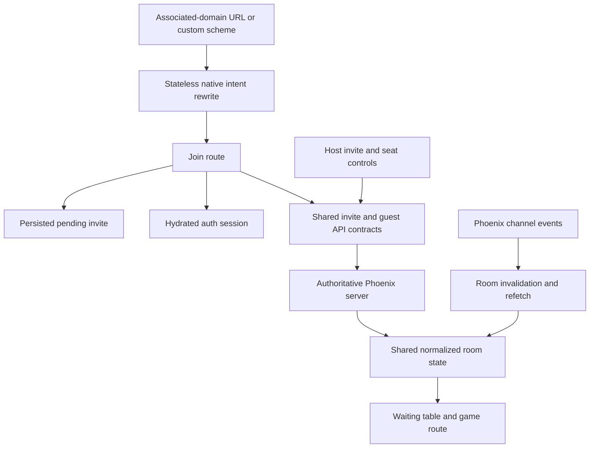
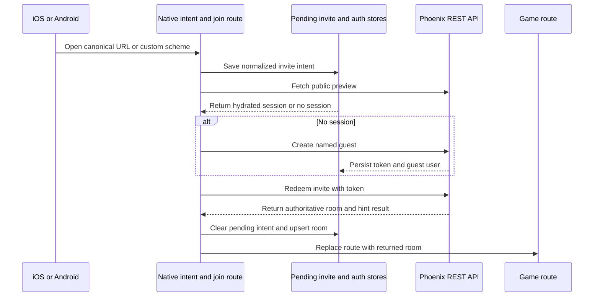
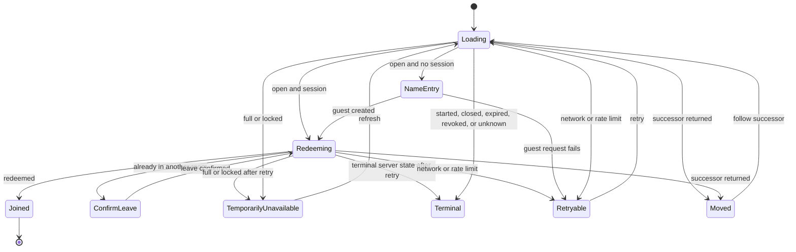
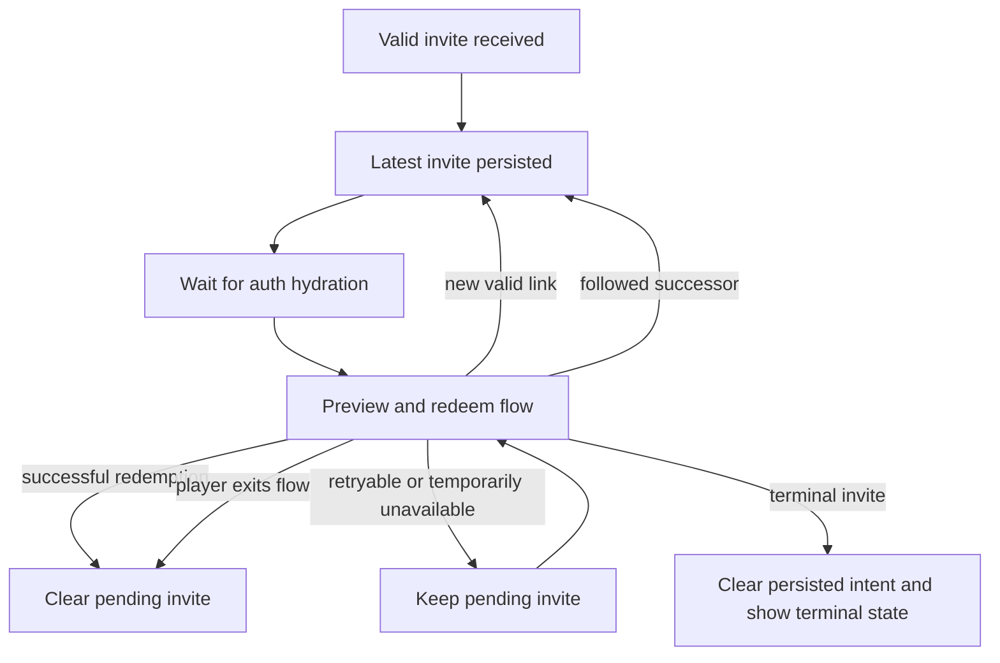
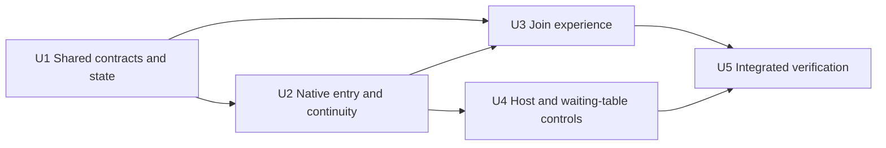

# Native Invite Links and Guest Join - Plan

## Goal Capsule

- **Objective:** A player with Pidro installed can open a table invite, join as an existing user or named guest, and reach the live table while the host can manage the invite and seats.
- **Means:** Extend the existing shared API/store boundaries and Expo Router screens with a direct Phase 3 join flow, without introducing a parallel client architecture (KTD1).
- **Authority:** The user-directed Phase 3 boundary takes precedence, followed by the deployed backend contract, the source requirements and research, project conventions, and this plan's technical decisions.
- **Execution profile:** Implement, review, test, commit, push, open a pull request, and monitor its checks on `feat/invites-phase-3-deep-links`.
- **Stop conditions:** Stop for a production API mismatch that requires backend work, a native association change outside the deployed contract, or any requirement that would pull Phase 4-6 behavior into this change.
- **Tail ownership:** The implementation workflow owns the branch through a reviewable pull request with passing required checks.

---

## Product Contract

### Summary

Implement the installed-app portion of the invite funnel across shared contracts and the Expo mobile client. The change covers native link entry, persisted join intent, guest or authenticated redemption, host invite actions, waiting-table controls, localization, and end-to-end proof against the deployed Phase 0-2 contract.

### Problem Frame

The backend invite contract and public landing page are live, but the installed app cannot yet receive a canonical invite URL or turn it into a native table join. An unauthenticated recipient is currently forced through the registration-shaped entry path, and a host cannot create or operate an invite from the waiting table.

### Key Decisions

- **Ship Phase 3 only** `(session-settled: user-directed — chosen over expanding into Phases 4-6: the user requested a bounded native release after the backend and landing work shipped)`. Governs R1-R13.
- **Keep the implementation simple and conventional** `(session-settled: user-directed — chosen over speculative abstractions: reliability, testability, and production maintenance are the requested quality bar)`. Governs R2-R12.

### Actors

- A1. An installed-app invitee who may be unauthenticated, authenticated, or already seated at a table.
- A2. A table host who creates and shares invites and manages waiting-table seats.
- A3. The deployed Phoenix server, which remains authoritative for invite, session, room, and seat state.
- A4. iOS and Android link dispatch, which delivers an associated-domain URL or custom scheme to Expo Router.

### Requirements

**Link entry and continuity**

- R1. The mobile app must claim canonical `https://www.pidro.online/j/<code>` links on iOS and Android, retain apex-host declarations for legacy links where platform association permits, and support the production, development, and preview custom schemes.
- R2. Native link handling must accept only recognized invite routes, normalize the invite code according to the backend contract, preserve an allowlisted attribution source, and safely fall back for malformed or unrelated input.
- R3. The latest valid invite intent must survive app launch and authentication hydration until redemption succeeds, the server confirms a terminal state, or the player explicitly leaves the flow.
- R4. A direct `/game/<room>` route without a hydrated session must not hang; it must resolve through the existing authentication entry behavior.

**Preview, identity, and redemption**

- R5. The join screen must fetch the public preview and represent open, full, locked, started, closed, expired, revoked, moved, unknown, loading, and recoverable network states without exposing the room code before redemption.
- R6. An unauthenticated invitee must be able to enter a display name that mirrors the server's normalized 2-20-grapheme contract, create a guest session through the deployed guest endpoint, and continue redemption without a registration detour; an authenticated player must skip name entry and server validation remains authoritative.
- R7. Successful redemption must send the native platform and retained attribution source, clear the pending intent, synchronize the authoritative room, and replace the route with `/game/<room>`; a non-honored partner hint must be communicated without blocking entry.
- R8. `ALREADY_IN_ROOM` must warn that leaving the current table is irreversible before one confirmed leave-and-retry attempt; a failed retry retains the invite and renders its authoritative state. A moved invite must replace pending state with the normalized successor, and host self-redemption must remain idempotent.
- R9. Guest identity fields and player display names must survive shared auth persistence and room normalization so the waiting table shows the intended human-readable name.

**Host and waiting-table operation**

- R10. A host must be able to create one active invite for partner or any open seat, add or clear an optional label, and then share, copy, display as QR, regenerate, or revoke it from the waiting table.
- R11. A host must be able to lock or unlock joining, move an occupied player to a legal open seat, and kick a non-host player while non-hosts cannot access those controls.
- R12. Waiting-table realtime events must trigger an authoritative room refresh, show a short joining placeholder where useful, and remove a kicked local player from the table flow.

**Quality and scope**

- R13. Every new invite and guest-facing string must use a thin English localization layer, and new screens and controls must meet existing touch-target, portrait, compact-landscape, and landscape UI grammar.

### Key Flows

- F1. Installed invite to join
  - **Trigger:** A4 opens a canonical invite URL or supported custom scheme.
  - **Actors:** A1, A3, A4
  - **Steps:** Normalize the link, retain the invite intent, fetch the preview, resolve identity, redeem, synchronize the room, and enter the game route.
  - **Covered by:** R1-R9, R13
- F2. Host invite lifecycle
  - **Trigger:** A2 opens invite controls at a waiting table.
  - **Actors:** A2, A3
  - **Steps:** Choose partner or any seat, mint the active invite, distribute its canonical URL, and optionally regenerate or revoke it.
  - **Covered by:** R10, R13
- F3. Host table management
  - **Trigger:** A2 changes table admission or an occupied seat.
  - **Actors:** A1, A2, A3
  - **Steps:** Send the host intent, accept the returned room state, refetch on realtime notification, and update the waiting table.
  - **Covered by:** R11-R13

### Acceptance Examples

- AE1. **Covers R1-R3, R5:** Given a cold installed app, when it receives `https://www.pidro.online/j/7kq4-m2xb?s=im`, then it opens the join route with the normalized code and retains `im` as the allowed source; the internal `source` alias and an apex-host legacy link follow the same internal route when the platform delivers them.
- AE2. **Covers R5-R7, R9:** Given an open invite and no session, when the recipient submits a valid display name, then the app creates a guest, redeems the invite, persists the guest session, and enters the returned room.
- AE3. **Covers R5-R7:** Given an open invite and a hydrated registered or guest session, when the join route loads, then name entry is skipped and redemption proceeds with that session.
- AE4. **Covers R5, R8:** Given a moved invite, when preview or redemption returns a successor, then the player can follow that successor without entering a room code; terminal invites explain that joining is unavailable.
- AE5. **Covers R8:** Given a player already seated elsewhere, when redemption reports `ALREADY_IN_ROOM`, then no room is left until the player confirms, after which the app leaves and retries once.
- AE6. **Covers R7-R8:** Given the host opens their own active invite, when redemption is attempted, then the server's idempotent room result enters the existing table and any partner-hint fallback is shown as a notice.
- AE7. **Covers R10, R13:** Given a waiting-table host, when they mint a partner invite with a label, then the canonical link and QR are available for the platform share sheet and clipboard and can later be regenerated or revoked.
- AE8. **Covers R11-R12:** Given a waiting-table host and another player, when the host locks joining, moves that player, or kicks them, then all connected clients converge on the server room state and a kicked local client exits the table.
- AE9. **Covers R5-R10, R12-R13:** Given the checked-out production backend contract, when the browser-driven mobile build follows an invite as a new guest, then a full four-player game can complete through the game-over state. Native dispatch and cold-launch continuity are proven by their dedicated conditional gates.

### Scope Boundaries

#### Deferred to Follow-Up Work

- Phase 4 deferred-install matching, install identifiers, store-referrer handling, and a manual “Have a code?” entry point.
- Phase 5 post-game registration, account conversion, and account deletion.
- Phase 6 web joining and any deployed web-client invite redemption surface; Expo web remains a local and CI test runtime only.

#### Outside This Change

- Backend invite behavior, landing-page behavior, association-file deployment, and invite schema changes beyond consuming the live Phase 0-2 contract.
- A new authentication architecture, navigation framework, generalized workflow engine, or client-owned game rules.
- A preview EAS profile or store release; this change prepares and verifies native configuration but does not ship a binary.

### Dependencies

- The production API at `https://app.pidro.online/api/v1` and Phoenix channels retain the deployed guest, invite, room-control, and event contracts.
- `https://www.pidro.online/.well-known/apple-app-site-association` continues to authorize the production, development, and preview iOS bundle identifiers for `/j/*`; the apex redirect is not a new-link dependency.
- `https://www.pidro.online/.well-known/assetlinks.json` continues to authorize the production Android package; development and preview validation use their custom schemes unless those packages are added upstream.

### Sources

- The enclosing-workspace “Invite Links and Guest Play Requirements” document dated 2026-09-02 defines Phase 3 behavior and the Phase 4-6 boundary.
- The linked “Invite Links, Deep Linking, and Guest Play Landscape” research document dated 2026-09-02 establishes the cross-platform invite funnel and native-link constraints.
- `packages/mobile/AGENTS.md` and `packages/mobile/PRODUCT.md` define the server-authoritative architecture and mobile UI grammar.
- `docs/solutions/developer-experience/pidro-3-ios-testing-workflow.md` defines the development and preview native-build verification workflow.
- Expo Router deep-linking, native-intent, localization, and platform association documentation constrain KTD2 and the native verification gates.
- React Native Share and Expo Clipboard documentation constrain KTD4.

---

## Planning Contract

### Key Technical Decisions

- KTD1. **Extend existing boundaries instead of adding a workflow framework.** `(session-settled: user-directed — chosen over speculative abstractions: the user asked for a simple, conventional, production-quality implementation)` Shared owns portable contracts and pure normalization; the mobile route owns presentation and orchestration. Implements R2-R12.
- KTD2. **Keep native intent rewriting stateless.** `+native-intent` recognizes supported paths and returns an internal join route inside a total, exception-safe function. Hydration, auth, persistence, and network work begin inside the routed React tree. Implements R1-R4 and follows Expo Router's native-intent contract.
- KTD3. **Treat socket events as invalidation hints, with one directed-exit exception.** The waiting table refetches room state after invite and seat events instead of reconstructing authoritative state locally. The server's local-only `kicked` event exits that client; a refetch failure alone never does. Implements R11-R12 and preserves the project's dumb-client architecture.
- KTD4. **Use platform-native text sharing and a focused QR renderer.** React Native `Share.share` distributes invite text, Expo Clipboard copies links, and `react-native-qrcode-svg` renders the canonical URL. This avoids the local-file semantics of `expo-sharing`. Implements R10.
- KTD5. **Make join recovery explicit and bounded.** The route uses a small set of visible phases and one confirmed leave-and-retry path for `ALREADY_IN_ROOM`; it does not add a generic state-machine dependency. Implements R5-R8.
- KTD6. **Keep Phase 3 identity anonymous but session-compatible.** Guest creation stores the same token-and-user session shape as registered auth, extends that shape with nullable email, `display_name`, and `guest`, and omits the optional install identifier reserved for deferred matching. Implements R3, R6, and R9.

### High-Level Technical Design

These diagrams describe boundaries and sequencing. They are directional, not implementation code.

**Component and data-flow topology**

**Invite-to-game protocol**

**Join-state decisions**

**Pending-intent lifecycle**

### API and State Mapping

- Public preview reads `data.invite` without a room code and maps `state`, host, seat counts, hint, label, expiry, and `next_code` when moved.
- Guest creation sends `display_name` and `invite_code`; it stores `data.user` and `token` in the existing auth store without an install identifier.
- Redemption sends the current native platform and an allowlisted source when present, then reads `data.room`, `position`, and `hint_honored`; the room passes through the shared normalizer before navigation.
- Invite creation sends an explicit nullable `seat_hint` and `label` so a new host choice can clear a prior choice. Regeneration consumes the returned invite, revocation clears local invite state after its no-content response, and seat, lock, and kick calls consume returned rooms.
- Error handling reads the server's first structured error code and details. `next_code` and `next_open` remain typed context rather than error-message parsing.

### Assumptions

- The newest valid incoming invite replaces an older pending invite because it represents the player's latest explicit navigation intent.
- A retryable, full, or locked invite remains pending until success or explicit exit; the client does not invent an age cutoff because the server owns availability and expiry.
- A guest session created before a later redemption failure remains a valid session and can retry; the app does not roll back server identity creation.
- Development and preview native tests prove custom-scheme delivery. Production-signed Android verification is the only reliable proof of the currently published `assetlinks.json` association.
- A deterministic join-screen fixture may bypass live network calls only in development UI-grammar mode; production routes always consume the real server contract.

### System-Wide Impact

- **Authentication lifecycle:** Guest creation enters the existing persisted auth session, so the same API interceptor, socket token source, logout behavior, and hydration gate apply to guests. A redeem request that receives `401` clears the session and returns the still-pending invite to identity entry.
- **Navigation lifecycle:** The pending invite is the only cross-launch join state. Native dispatch never receives a token, room code, or arbitrary redirect target, and a moved response is normalized as a successor invite code before routing.
- **Untrusted text:** Invite labels and display names remain plain React Native text. They are never treated as markup, interpolated into a URL target, or written to logs with tokens.
- **Authorization:** Host-only visibility improves UX but is not the security boundary. Every mint, revoke, regenerate, lock, move, and kick intent still relies on server authorization and handles rejection without applying optimistic room authority.
- **Realtime consistency:** New channel callbacks invalidate waiting-room data only. They do not change game rules or seat ownership locally, which keeps REST/channel ordering races recoverable.

### Sequencing

### Risks and Mitigations

- **Association verification differs by host and variant.** The no-redirect `www` Apple file includes all iOS variants, while Android currently includes only production. The apex redirects to `www`, so it is legacy compatibility rather than a canonical verification target. Verify custom schemes for development and preview and record the production-only Android association constraint without changing Phase 2 infrastructure.
- **Guest creation can succeed before redemption fails.** Keep the valid guest session and render the authoritative invite state so retry does not create duplicate identities.
- **Realtime messages can arrive before the REST response or in bursts.** Coalesce room refreshes and use returned/refetched room state rather than applying event payloads as truth.
- **Invite routes and successor codes are attacker-controlled input.** Normalize them against the fixed host, scheme, path, source, and Crockford-code allowlists before persistence or navigation; never follow a server or link value as an arbitrary URL.
- **Custom schemes can be claimed by another installed app.** Accept this existing fallback risk only for table-scoped, expiring, revocable invite codes; canonical new shares use the verified `www` HTTPS URL and no account credential is placed in a link.
- **Host controls can be exposed by a modified client.** Treat UI permission checks as presentation only and test rejected server responses without optimistic state changes.
- **Waiting-table controls can crowd compact layouts.** Put secondary host actions behind focused modals or contextual controls and protect existing minimum touch targets and seat geometry.
- **Native config changes require a rebuilt development client.** Use generated-config inspection and a clean native build when available; do not claim Expo Go proves associated-domain behavior.

---

## Implementation Units

### U1. Shared invite, guest, and room contracts

- **Goal:** Give both platform code and tests one typed, server-aligned representation of invite links, invite APIs, guest identity, pending intent, and display names.
- **Requirements:** R2-R3, R5-R12; KTD1, KTD3, KTD6
- **Dependencies:** None.
- **Files:** `packages/shared/src/api/auth.ts`, `packages/shared/src/api/invites.ts`, `packages/shared/src/api/lobby.ts`, `packages/shared/src/api/index.ts`, `packages/shared/src/stores/auth.ts`, `packages/shared/src/stores/pendingInvite.ts`, `packages/shared/src/stores/index.ts`, `packages/shared/src/types/lobby.ts`, `packages/shared/src/utils/inviteLink.ts`, `packages/shared/src/utils/rooms.ts`, `packages/shared/src/utils/index.ts`, `packages/shared/src/index.ts`, `packages/shared/test/inviteLink.test.ts`, `packages/shared/test/invitesApi.test.ts`, `packages/shared/test/pendingInvite.test.ts`.
- **Approach:** Add the narrow API methods and response types that mirror the deployed envelopes. Reuse injected persistence for pending intent and auth. Keep code normalization and supported-source parsing pure so native routing and tests share it.
- **Test scenarios:** Normalize lowercase and dashed Crockford codes; map `I` and `L` to `1` and `O` to `0`; reject `U`, invalid lengths, unsupported hosts, unsupported schemes, and unrelated paths; round-trip pending intent through persistence; clear it explicitly; create a guest; preview, mint, regenerate, revoke, redeem, lock, move, and kick through request-shape tests; preserve nullable email, guest metadata, display names, and room lock state through normalization.
- **Verification:** Shared build and focused Bun tests pass with no public export or strict-TypeScript errors.

### U2. Native link entry, pending navigation, and localization foundation

- **Goal:** Deliver supported native links into a persistent internal join route and prevent unauthenticated direct routes from hanging.
- **Requirements:** R1-R4, R13; F1 link-entry steps; AE1; KTD1-KTD2
- **Dependencies:** U1.
- **Files:** `packages/mobile/app.config.js`, `packages/mobile/app.json`, `packages/mobile/app/+native-intent.tsx`, `packages/mobile/app/_layout.tsx`, `packages/mobile/app/index.tsx`, `packages/mobile/app/game/[code].tsx`, `packages/mobile/src/stores/pendingInvite.ts`, `packages/mobile/src/i18n/index.ts`, `packages/mobile/src/i18n/en.json`, `packages/mobile/test/navigation/nativeIntent.test.mjs`, `packages/mobile/package.json`, `bun.lock`.
- **Approach:** Add associated domains, Android verified-link filters, English fallback localization with device-locale selection, and scheme-preserving variant config. Make native intent parsing delegate to the shared pure normalizer. Hydrate auth and pending state before index routing, giving a pending invite precedence over normal auth entry. Gate the direct game route after unconditional hook setup.
- **Test scenarios:** Rewrite production-domain, `www`, relative, and all three scheme variants; preserve only allowed source values; reject nested or encoded path tricks and arbitrary successor targets; return a safe fallback for malformed inputs and parser exceptions; reopen a persisted pending invite after hydration; route a no-session direct game URL to auth instead of leaving a loader; inspect resolved Expo config for every app variant.
- **Verification:** Focused navigation tests, mobile type checking, `expo install --check`, and resolved Expo configuration prove route and manifest shape. A development client opens production, development, and preview scheme examples where a native runtime is available.

### U3. Native invite preview, guest creation, and redemption

- **Goal:** Turn the join route into the complete installed-app invitee experience through authoritative room navigation.
- **Requirements:** R3, R5-R9, R13; F1; AE1-AE6; KTD1, KTD5-KTD6
- **Dependencies:** U1-U2.
- **Files:** `packages/mobile/app/join/[code].tsx`, `packages/mobile/src/api/auth.ts`, `packages/mobile/src/api/invites.ts`, `packages/mobile/src/components/invites/JoinInviteScreen.tsx`, `packages/mobile/src/utils/apiErrors.ts`, `packages/mobile/src/stores/auth.ts`, `packages/mobile/src/stores/lobby.ts`, `packages/mobile/src/i18n/en.json`, `packages/mobile/test/invites/joinFlow.test.mjs`.
- **Approach:** Keep the visible join phases in the route/component boundary and isolate only pure outcome mapping for tests. Fetch preview before identity collection. Create and persist a guest only after a valid name submission. Redeem with the current token, handle moved and confirmed already-seated recovery, then normalize/upsert the room and replace navigation.
- **Test scenarios:** Render preview before name entry; prefill a safe label without bypassing validation; mirror the server's trim, normalization, 2-20-grapheme, and control-character errors while treating its structured response as authoritative; disable repeated name and redeem submission while a request is active; skip name entry for hydrated sessions; retain a guest after a redeem network error; render every authoritative invite state; clear persisted intent for terminal states while keeping their current message visible; replace pending state with a normalized moved successor; warn before leaving another room and retain authoritative retry failure after one attempt; navigate on idempotent host redemption; send platform and only an allowlisted source; announce a non-honored partner hint and state changes accessibly; clear pending on success or explicit exit; recover from a 401-cleared session by returning to guest entry; render labels and display names as text without logging credentials.
- **Verification:** Focused flow tests cover outcome mapping and side-effect boundaries. The UI-grammar harness captures the open invite state in portrait, compact landscape, and landscape with touch-target checks.

### U4. Host invite actions and waiting-table controls

- **Goal:** Let the host distribute and administer table access while all clients converge on server state.
- **Requirements:** R9-R13; F2-F3; AE7-AE8; KTD1, KTD3-KTD4
- **Dependencies:** U1-U2.
- **Files:** `packages/mobile/app/game/[code].tsx`, `packages/mobile/src/api/invites.ts`, `packages/mobile/src/api/lobby.ts`, `packages/mobile/src/channels/hooks/useGameChannel.ts`, `packages/mobile/src/components/game/WaitingTable.tsx`, `packages/mobile/src/components/invites/InviteModal.tsx`, `packages/mobile/src/i18n/en.json`, `packages/mobile/test/channels/gameChannelEvents.test.mjs`, `packages/mobile/test/invites/hostInvite.test.mjs`, `packages/mobile/package.json`, `bun.lock`.
- **Approach:** Derive host permission from the normalized room and current user. Keep invite lifecycle in one modal. Use contextual seat actions for move and kick and a focused control for lock state. Feed returned rooms into the lobby store, and let channel notifications trigger bounded refetches plus transient joining feedback.
- **Test scenarios:** Hide controls from non-hosts; mint partner and any-seat invites with label set and cleared; share/copy the canonical link; render its QR; regenerate and revoke; lock and unlock; reject host kick and illegal seat actions in the UI; preserve room state when the server rejects a forged or stale host action; move or kick another player and accept returned room state; coalesce burst events; show and clear joining feedback; exit when the local user is kicked; prefer display name over generated username.
- **Verification:** Focused event and host-action tests pass. Waiting-table UI captures remain readable and operable across all supported viewports.

### U5. Integrated invite-to-full-game and native verification

- **Goal:** Prove the complete Phase 3 path against the checked-out production backend contract and the native platforms available in the environment.
- **Requirements:** R1-R13; F1-F3; AE1-AE9
- **Dependencies:** U2-U4.
- **Files:** `packages/mobile/scripts/ci-game-e2e.mjs`, `packages/mobile/scripts/verify-ui-grammar.mjs`, `packages/mobile/test/ui-baselines/portrait/`, `packages/mobile/test/ui-baselines/compact-landscape/`, `packages/mobile/test/ui-baselines/landscape/`, `.github/workflows/frontend-ci.yml`.
- **Approach:** Use Expo web only as the existing local and CI mobile test harness. Extend its browser-driven game scenario to mint a real invite, clear browser identity, open the join route, create a guest, redeem, and finish a four-player game. Add deterministic visual coverage for join and changed waiting-table states. Validate native association configuration and exercise schemes or app links on available simulator/device builds.
- **Test scenarios:** Complete invite-to-guest-to-game-over with the live backend implementation; fail with useful artifacts if preview, guest creation, redemption, socket synchronization, or game completion stalls; compare all new visual baselines; cold-open and warm-open an intentionally invalid invite scheme without creating production data on an available iOS build; inspect Android intent filters and use `adb` link verification only when a compatible signed build and device are available.
- **Verification:** The repository CI-equivalent unit, lint, type, dependency, export, UI grammar, visual diff, and game e2e gates pass. Native checks record exactly which variants and delivery mechanisms were exercised.

---

## Verification Contract

| Gate | Command or method | Covers | Done signal |
|---|---|---|---|
| Shared build | `bun run shared:build` | U1-U5 | Shared JavaScript and declarations compile without errors. |
| Unit tests | `bun run test:unit` | U1-U4 | Link, persistence, API, auth, join, event, and host-control cases pass. |
| Mobile lint and formatting | From `packages/mobile`, `bun run lint` | U2-U5 | ESLint and Prettier report no violations. |
| Mobile type safety | From `packages/mobile`, `bunx tsc --noEmit` | U2-U5 | Strict TypeScript reports no errors. |
| Expo dependency compatibility | From `packages/mobile`, `bunx expo install --check` | U2-U5 | Expo reports compatible dependency versions. |
| Production web export | From `packages/mobile`, run the same environment-backed `bunx expo export --platform web` command as `.github/workflows/frontend-ci.yml` | U2-U5 | Static export completes, proving routes and web-safe module boundaries compile. |
| UI grammar | From `packages/mobile`, `bun run test:ui` and `bun run test:ui:diff` against a local Expo web server | U3-U5 | All viewports meet geometry and touch-target checks and approved baselines match. |
| Invite game e2e | From `packages/mobile`, `bun run test:e2e` with the checked-out backend and Expo web server | U3-U5 | A newly created guest follows an invite and the table completes through game over. |
| Deployed-contract smoke | Read the production OpenAPI document, an invalid public invite preview, and no-redirect `www` association responses without creating production data | U1-U2, U5 | Required endpoints and envelopes remain present, unknown preview remains non-mutating, and canonical association files return direct JSON responses. |
| Resolved native config | `APP_VARIANT` set to production, development, and preview with `bunx expo config --type public` | U2, U5 | Each variant retains its identifier and scheme and emits the intended iOS domains and Android filters. |
| iOS native link check | Clean development or preview build, then `bunx uri-scheme open <supported-url> --ios` and a canonical HTTPS open when entitlement association is available | U2, U5 | The installed build cold- or warm-opens the normalized join route. |
| Android native link check | Clean available build plus `bunx uri-scheme open <supported-url> --android`; use `adb shell pm verify-app-links` and link resolution for production-signed association testing | U2, U5 | Custom scheme opens the join route, and production app-link verification passes when the required signed build exists. |

Native checks are conditional on installed toolchains, simulator or device availability, and a rebuild after config changes. An unavailable native runtime must be reported on the pull request as a named residual for each unexercised variant and delivery mechanism, not represented as a passing check. Resolved native configuration is partial evidence for R1; only an installed OS routing check proves delivery.

---

## Definition of Done

- Every requirement has an implemented path and a passing automated or explicitly conditional verification gate.
- Canonical HTTPS links and all supported schemes resolve through one normalization contract without auth or network work in `+native-intent`.
- Guest and authenticated recipients reach the server-returned game route, and pending invite state clears only at the defined lifecycle exits.
- Host invite, share, QR, revoke, regenerate, lock, move, and kick actions are permissioned in the UI and remain server-authoritative.
- New strings are localized, display names render correctly, and changed screens pass existing responsive and touch-target standards.
- The checked-out backend completes the invite-to-guest-to-full-game scenario.
- Production, development, and preview Expo configuration is inspected; every native behavior that the environment can support is exercised and the rest is named precisely.
- Full repository verification passes, review findings are resolved or explicitly recorded, and required CI checks are green.
- No Phase 4 deferred-install, Phase 5 conversion/deletion, Phase 6 web-join, speculative framework, dead experiment, duplicate helper, or abandoned attempt remains in the diff.
- The branch is committed, pushed, and represented by a focused pull request that explains scope, verification evidence, and any native-environment limitation.
