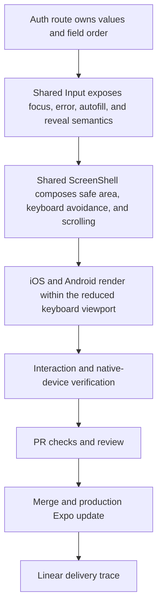

# Mobile Auth Keyboard Experience - Plan

## Goal Capsule

- **Objective:** Players can sign in or create an account on iOS and Android without the software keyboard hiding the active field, validation guidance, or primary action in portrait or landscape.
- **Means:** Use the existing React Native and Expo primitives for keyboard avoidance, scrolling, focus sequencing, field semantics, and accessible password controls; ship the merged change through the production update channel (KTD1-KTD5).
- **Authority:** PID-65 and the session-settled product decisions govern the auth experience. Existing server auth contracts remain authoritative for credential validation and session creation.
- **Execution profile:** Implement, verify, review, merge, publish to the production update channel, and confirm the release artifact reaches eligible devices.
- **Stop conditions:** Stop before merge for a correctness, security, or regression finding. Stop before publishing if required CI is not green or the update is incompatible with installed production runtimes. Stop and roll back if the production-device auth smoke check regresses sign-in or registration.
- **Tail ownership:** The implementing agent owns PR feedback, CI, merge, production distribution, and Linear closure.

---

## Product Contract

### Summary

Make login and registration frictionless under real mobile keyboard pressure. Keep fields, guidance, and actions reachable; reduce unnecessary input; and preserve the current visual identity and server-owned auth behavior.

### Problem Frame

PID-65 records that the keyboard overlaps auth fields and controls on iOS and Android, especially in short landscape layouts. The current forms also provide limited focus guidance, suppress submit-time validation by disabling the primary action, retain stale server errors while the user edits, and ask new players to enter the same password twice.

### Requirements

**Keyboard and layout**

- R1. The focused field, its validation message, and the primary action remain reachable while the software keyboard is open in portrait and landscape on iOS and Android.
- R2. Auth screens respect all safe areas and allow keyboard-aware scrolling without swallowing taps on form controls.
- R3. Rotation recomposes the form without losing entered values or returning the player to an earlier route. Android may dismiss the keyboard as part of the system orientation transition; the same form and values remain visible so the player can resume with one tap.
- R4. Android keeps the auth form visible instead of entering a full-screen input editor in short landscape layouts.

**Form interaction**

- R5. The keyboard action advances focus in reading order and submits from the last field.
- R6. Each field exposes the correct username, email, or password input semantics to the platform for keyboard layout and credential autofill.
- R7. Submitting incomplete input shows a concise error beside each invalid field and moves focus to the first invalid field.
- R8. Editing a field clears its stale field error and any stale server auth error.
- R9. A password is concealed by default and can be revealed or hidden with an accessible control without changing its value, autofill purpose, or no-learning/no-suggestion semantics.
- R10. Registration asks for a password once and relies on the reveal control for typo recovery.
- R11. Auth requests cannot be submitted again while a request is in flight, and current server success and failure behavior remains unchanged.

**Delivery**

- R12. The change merges only after required repository checks pass and is published to production devices through the fastest compatible Expo delivery path.
- R13. PID-65 links to the shipped PR and is completed only after merge and a successful distribution receipt.

### Key Decisions

- **Remove password confirmation from registration** (session-settled: user-approved — chosen over a duplicate password field: a reversible reveal control catches typing mistakes with less friction). Governs R9-R10.
- **Deliver the complete polished interaction in this change** (session-settled: user-directed — chosen over keyboard avoidance alone: focus, validation, autofill, reveal, and rotation behavior are part of a stellar auth experience). Governs R1-R11.
- **Own the full release tail** (session-settled: user-directed — chosen over a PR-only handoff: the requested outcome is code on devices). Governs R12-R13.

### Key Flows

- F1. Sign in with keyboard navigation
  - **Trigger:** A returning player opens login and starts entering credentials.
  - **Steps:** Enter username; use Next; enter or reveal the password; use Go or tap Sign in; correct inline errors when present.
  - **Outcome:** Focus follows reading order, required controls remain reachable, and server-confirmed success enters the app.
  - **Covered by:** R1-R9, R11.
- F2. Create an account with minimal input
  - **Trigger:** A new player opens registration.
  - **Steps:** Enter username and email; advance with Next; enter one password; optionally reveal it; submit with Go or the primary action.
  - **Outcome:** The account request uses the existing server contract without duplicate password entry.
  - **Covered by:** R1-R11.
- F3. Rotate during entry
  - **Trigger:** A player rotates the device while an auth field contains input or the keyboard is open.
  - **Steps:** Recompose the safe-area and keyboard-aware layout; preserve controlled values; keep all form content reachable.
  - **Outcome:** The player continues the same task with no data loss or overlap.
  - **Covered by:** R1-R4.
- F4. Release to devices
  - **Trigger:** The PR is approved and all required checks pass.
  - **Steps:** Merge; synchronize local main; pass the repository release gate; publish a production Expo update; verify its receipt and compatible platforms.
  - **Outcome:** Eligible installed iOS and Android clients receive the fix, and PID-65 carries the delivery trace.
  - **Covered by:** R12-R13.

### Acceptance Examples

- AE1. Covers R1-R8 and R11. Given blank login fields in portrait or landscape, when the player taps Sign in, then both field errors appear, username receives focus, and every required control is reachable with the keyboard open.
- AE2. Covers R1-R11. Given valid registration values, when the player uses Next through username and email and Go from password, then the form submits once, contains no confirmation field, and preserves the password across reveal and hide.
- AE3. Covers R1-R4. Given partially entered auth data and an open Android keyboard, when the device rotates in either direction, then the form stays in the application surface, retains values, and remains scrollable without overlap; a system-dismissed keyboard can be resumed by tapping the same field.
- AE4. Covers R12-R13. Given a merged commit with green required checks, when the production update command completes, then its receipt identifies the production channel and compatible runtime, and an installed production client confirms the update before the issue links the PR and release outcome.

### Success Criteria

- Android device verification passes both orientations with the keyboard open, focus advancing, validation visible, and password reveal working.
- Native iOS simulator or device verification passes both orientations with the keyboard open, login and registration reachable, and safe areas intact.
- The deterministic auth interaction suite passes at both target viewport sizes without new page errors.
- Required CI completes successfully on the PR and merged commit before release.
- Expo reports a successful production update for the merged commit and all compatible mobile platforms, and an installed production client applies that update without an auth regression.

### Scope Boundaries

**In scope**

- Login, registration, the shared auth screen shell, the shared input primitive, auth-error clearing, interaction checks, and the registration visual baseline.
- Production Expo update delivery plus a native build fallback if runtime compatibility prevents OTA delivery.

### Deferred to Follow-Up Work

- Password-manager passkeys, social sign-in, account recovery, and changes to server password policy.
- Removing confirmation makes the reveal control the immediate typo-recovery aid; the existing shared password-reset API is not exposed as a new mobile recovery flow in this change and remains a prioritized follow-up.
- A broader refactor of non-auth forms or unrelated visual-baseline drift.

### Sources and Research

- `PID-65` in Linear defines the cross-platform keyboard, safe-area, scrolling, focus, and orientation problem.
- `docs/plans/2026-07-10-001-refactor-mobile-ui-grammar-plan.md` establishes rotation state preservation and requires native keyboard verification beyond web screenshots.
- `docs/solutions/developer-experience/pidro-3-ios-testing-workflow.md` defines the repository's simulator, physical-device, Expo, and TestFlight paths.
- [React Native: Improving User Experience](https://reactnative.dev/docs/improvingux) recommends configuring text inputs, advancing or submitting from the return key, and using `KeyboardAvoidingView` when the keyboard can cover controls.
- [React Native: KeyboardAvoidingView](https://reactnative.dev/docs/keyboardavoidingview) recommends an explicit behavior on iOS and Android.
- [Expo app configuration](https://docs.expo.dev/versions/latest/config/app/) maps `android.softwareKeyboardLayoutMode` to Android window soft-input behavior and documents `resize` as the default.
- [Expo: Runtime versions and updates](https://docs.expo.dev/eas-update/runtime-versions/) defines runtime compatibility as the JS-to-native contract and warns that native interface changes require a new build.
- [Expo: Get started with EAS Update](https://docs.expo.dev/eas-update/getting-started/) requires the EAS environment argument for update publishing on SDK 55 and later.
- [Android: Handle input method visibility](https://developer.android.com/develop/ui/views/touch-and-input/keyboard-input/visibility) recommends `adjustResize` when controls must remain accessible during text entry.
- [Android: Specify the input method type](https://developer.android.com/develop/ui/views/touch-and-input/keyboard-input/style) requires appropriate input types and supports Next or Done actions.
- [Apple: Text fields](https://developer.apple.com/design/human-interface-guidelines/text-fields) recommends persistent labels, secure password entry, logical focus order, appropriate keyboards, and contextual validation.
- [Apple: Writing](https://developer.apple.com/design/human-interface-guidelines/writing) recommends actionable inline errors that explain how to correct input.

---

## Planning Contract

### Key Technical Decisions

- KTD1. Use the existing `SafeAreaView`, `KeyboardAvoidingView`, and `ScrollView` composition in the shared screen shell. This keeps the solution inside supported React Native primitives and applies keyboard reachability consistently without a new dependency. (session-settled: user-approved — chosen over a third-party keyboard manager: the native primitives satisfy the issue with less lifecycle and upgrade risk)
- KTD2. Set Android soft-input layout to `resize`, disable full-screen input UI on text fields, and re-key Android keyboard avoidance on orientation changes. The explicit native default documents the contract, while the orientation key refreshes keyboard geometry without replacing controlled form state. (session-settled: user-approved — chosen over pan-only or custom inset arithmetic: resize and recomposition align with platform behavior and reduce device-specific tuning)
- KTD3. Keep validation and focus ownership inside each auth route. The routes know field order and submit rules, while the shared input remains reusable and presentation-focused. (session-settled: user-approved — chosen over a form framework: the two small forms do not justify another abstraction or dependency)
- KTD4. Extend the shared input with focus styling, an alert-role error, and an accessible password visibility control. Centralizing these field-level behaviors prevents login and registration from drifting.
- KTD5. Publish an Expo production OTA after merge with the production EAS environment. The behavioral work uses APIs already present in the installed Expo SDK 56 runtime. The explicit Android `resize` value matches Expo's documented native default, so it does not change the existing JS-to-native contract for runtime `3.0.0`. If EAS identifies an incompatible installed runtime, use a production native build for the affected platform rather than bypassing compatibility.

### High-Level Technical Design

### Assumptions

- Installed production clients use an Expo runtime compatible with the merged JavaScript update.
- The production channel targets both mobile platforms unless EAS reports a narrower compatible set.
- The shared auth client and existing web registration flow already call the registration endpoint with username, email, and password only; U2 verifies the mobile route preserves that established request contract before removing the presentation-only confirmation field.
- Native iOS keyboard behavior requires simulator or device evidence. Android emulator or device evidence is also mandatory because the supplied failure reference is Android.

### Sequencing and Dependencies

The shared shell and input behavior land before route-specific focus and validation wiring. Interaction coverage and baseline evidence validate the composed result. PR, CI, merge, release, and Linear closure happen only after the code gates pass.

### Risks and Mitigations

| Risk | Consequence | Mitigation |
| --- | --- | --- |
| Keyboard avoidance and Android resize both add vertical adjustment | Short layouts can receive excess padding | Verify the actual Android keyboard in both orientations and use scrolling as the overflow path. |
| Android orientation changes leave stale keyboard geometry | The focused field or action can remain off-screen | Refresh only the Android avoidance wrapper on orientation change while keeping controlled values above it. |
| Password reveal changes native input mode | Text or selection can reset on some devices | Keep the input controlled and verify value preservation across show and hide. |
| Web screenshots differ from native keyboard behavior | Deterministic UI checks can pass while a device still overlaps | Keep native device verification as a separate release gate. |
| OTA runtime incompatibility | Some installed builds cannot receive the update | Confirm the update targets runtime `3.0.0` on both platforms, inspect EAS compatibility reporting, and trigger a production native build for any affected platform. |
| SDK 56 update omits its EAS environment | Production variables can be missing or the publish command can stop for input | Pass the production EAS environment through the repository release script. |
| Unrelated UI test timing is flaky | A non-auth failure can obscure PID-65 confidence | Re-run the failing case to distinguish an existing timing failure; do not weaken its assertion or update unrelated baselines. |
| A successful production OTA regresses auth on an installed client | Players can be locked out at the app entry point | Smoke-test auth after the installed client applies the update; if it fails, immediately republish the previous production update with `eas update:republish` and record the rollback on PID-65. |

---

## Implementation Units

### U1. Make the shared screen and input primitives keyboard-ready

- **Goal:** Provide one safe, accessible foundation for keyboard-constrained forms.
- **Requirements:** R1-R4, R6-R7, R9; KTD1-KTD2, KTD4.
- **Dependencies:** None.
- **Files:** `packages/mobile/app.json`; `packages/mobile/src/components/ui/ScreenShell.tsx`; `packages/mobile/src/components/ui/Input.tsx`.
- **Approach:** Compose keyboard avoidance inside the existing safe area, keep scroll overflow and tap handling, refresh Android geometry on rotation, and add reusable focus, inline-error, input-mode, and password-reveal behavior.
- **Patterns to follow:** Existing Pidro tokens, `PressableFX`, controlled React Native inputs, and the shared screen-shell boundary.
- **Test scenarios:**
  - Focus a field with the software keyboard open in portrait and landscape; the field and primary action remain reachable by scrolling.
  - Rotate Android with entered text; values remain and the form stays out of the full-screen editor.
  - Reveal and hide a password; its value remains identical and assistive technology receives the current action and state.
- **Verification:** Type checks and lint pass, minimum touch targets remain valid, and Android native verification satisfies AE3.

### U2. Make login and registration frictionless

- **Goal:** Wire each auth route to logical focus, actionable validation, autofill, and single-submit behavior.
- **Requirements:** R5-R11; F1-F2; AE1-AE2; KTD3-KTD4.
- **Dependencies:** U1.
- **Files:** `packages/mobile/app/(auth)/login.tsx`; `packages/mobile/app/(auth)/register.tsx`; `packages/mobile/src/hooks/useAuth.ts`; `packages/mobile/scripts/verify-ui-grammar.mjs`.
- **Approach:** First confirm the shared auth client and existing web flow use the established username/email/password registration request with no confirmation value. Then keep route-local controlled values and field refs, normalize username and email at submission, focus the first invalid field, clear stale errors on edit, use Next and Go actions, remove password confirmation, and prevent repeat requests while loading. Intercept auth in automated interaction checks so valid-submit coverage never creates a real account.
- **Patterns to follow:** Existing `useAuth` request ownership, Expo Router success navigation, and shared `Input` and `Button` components.
- **Test scenarios:**
  - Covers AE1. Submit blank login; both inline errors appear and username receives focus.
  - Enter a username and press Next; password receives focus and the corrected username error disappears.
  - Covers AE2. Navigate registration username to email to password with Next and submit from Go.
  - Submit registration with missing values; all relevant errors appear and focus lands on the first invalid field.
  - Edit after a server error; the stale server message clears without changing other field values.
  - Press submit repeatedly while loading; only one auth request remains active.
- **Verification:** Auth interaction checks pass at both target viewport sizes, including a stubbed Go-key submission with the established request shape; no confirm-password control remains, and server auth call shapes are unchanged.

### U3. Capture stable visual and behavioral evidence

- **Goal:** Protect the auth UX against regressions without accepting unrelated screenshot drift.
- **Requirements:** R1-R11; F1-F3; AE1-AE3.
- **Dependencies:** U1-U2.
- **Files:** `packages/mobile/scripts/verify-ui-grammar.mjs`; `packages/mobile/test/ui-baselines/portrait/register.png`; `packages/mobile/test/ui-baselines/landscape/register.png` when its captured pixels change.
- **Approach:** Extend the deterministic UI verifier with auth interactions after screenshot capture, update only the intentional registration baselines at captured viewports whose pixels change, and keep native keyboard checks separate from web geometry.
- **Patterns to follow:** Existing viewport matrix, geometry assertions, page-error collection, and committed visual baselines.
- **Test scenarios:**
  - Run login and registration at portrait and landscape target sizes; validation, focus order, password reveal, and value preservation pass with no page errors.
  - Compare all baselines; registration has no unexpected diff and unrelated drift remains unmodified.
  - Re-run an unrelated timing failure before classifying it; preserve the original behavioral assertion.
- **Verification:** The full UI suite passes or any unrelated pre-existing flake is isolated with a passing PID-65 subset and no weakened coverage.

### U4. Land and distribute PID-65

- **Goal:** Move the reviewed fix from branch to eligible production devices with an auditable issue trail.
- **Requirements:** R12-R13; F4; AE4; KTD5.
- **Dependencies:** U1-U3.
- **Files:** `packages/mobile/scripts/ship.mjs`; GitHub, EAS, and Linear delivery surfaces.
- **Approach:** Keep the existing release gate and add the required production environment to its OTA command. Open a PID-65 PR, address review and CI until merge-ready, merge using repository conventions, synchronize main, pass the gate, publish to the production update channel, verify the EAS receipt, and attach the PR and release result to PID-65 before marking it Done.
- **Execution note:** Treat this as an operational proof unit. Do not use an emergency gate bypass. A persistent unrelated release-gate failure halts the release for user direction instead of being bypassed, re-scoped, or silently absorbed. Use a native production build only if OTA compatibility blocks eligible devices; build completion alone is not delivery, so submit it to the applicable store and record delivery-pending-store-release until it becomes available.
- **Test scenarios:**
  - Required PR checks complete successfully on the final head commit.
  - The merged main commit has the required release-gate checks.
  - The SDK 56 OTA command selects the production EAS environment without an interactive prompt.
  - Covers AE4. EAS accepts the production update and reports its compatible platforms and runtime.
  - An installed production client on the production channel applies the new update identifier and passes an auth smoke check.
  - If that check fails, republish the previous production update before attempting another release.
  - If OTA is incompatible, a production build is submitted and available through the applicable store before the issue is closed.
- **Verification:** The PR is merged, the production release has a successful URL or identifier, an installed production client confirms delivery and auth health, and PID-65 records the artifacts in Done state.

---

## Verification Contract

| Gate | Command or evidence | Units | Pass signal |
| --- | --- | --- | --- |
| Static correctness | From `packages/mobile`: `bunx tsc --noEmit` | U1-U4 | TypeScript exits successfully. |
| Source quality | From `packages/mobile`: `bun run lint` | U1-U4 | ESLint and Prettier checks pass. |
| Registration contract | Shared auth client inspection plus stubbed submit-request assertion | U2 | The client sends only the established username, email, and password payload and receives the existing success shape without reaching a live backend. |
| Auth behavior and geometry | From `packages/mobile`: `bun run test:ui` | U1-U3 | All auth cases pass at portrait and landscape targets; no assertion is weakened. |
| Visual comparison | From `packages/mobile`: `bun run test:ui:diff` | U3 | Registration matches its intended baseline; no unrelated baseline is rewritten. |
| Android keyboard | API-compatible Android emulator or device with Gboard | U1-U3 | AE1-AE3 pass in both orientations, including rotation with entered values. |
| iOS keyboard | Native iOS simulator or device | U1-U3 | Login and registration remain reachable in both orientations with safe areas intact. |
| Pull request | GitHub required checks and resolved review threads | U4 | The final PR head is green, current, and mergeable. |
| Release gate | `bun run ship:ota` from `packages/mobile` on clean, synchronized `main` | U4 | Repository gate confirms Mobile quality, UI grammar, and Game e2e for the merged commit; EAS publishes successfully. |
| Device delivery | Installed production client on the production channel | U4 | The client applies the published update identifier and auth smoke-checks successfully; otherwise the prior update is republished. |
| Delivery trace | GitHub PR URL, EAS update/build URL or identifier, installed-client evidence, and Linear PID-65 | U4 | The issue contains the delivery artifacts and is Done. |

---

## Definition of Done

### Global Completion

- R1-R13 and AE1-AE4 are satisfied with traceable implementation and evidence.
- The diff contains no new keyboard library, form framework, auth API change, unrelated baseline update, or abandoned experimental code.
- Required PR checks and review threads are green and resolved on the final head commit.
- The PR is merged, a compatible production update is applied and smoke-tested on an installed client, or a native fallback is submitted and available through the applicable store.
- PID-65 links the PR and release result and is marked Done.

### Unit Completion

- U1. Shared primitives keep the form usable under keyboard, safe-area, and rotation pressure with accessible password handling.
- U2. Login and registration provide logical focus, inline recovery, correct input semantics, one password entry, and single-submit safety.
- U3. Deterministic interaction coverage and the intended visual baseline protect the changed behavior without absorbing unrelated drift.
- U4. The merged commit reaches eligible production devices and has GitHub, EAS, and Linear receipts.
